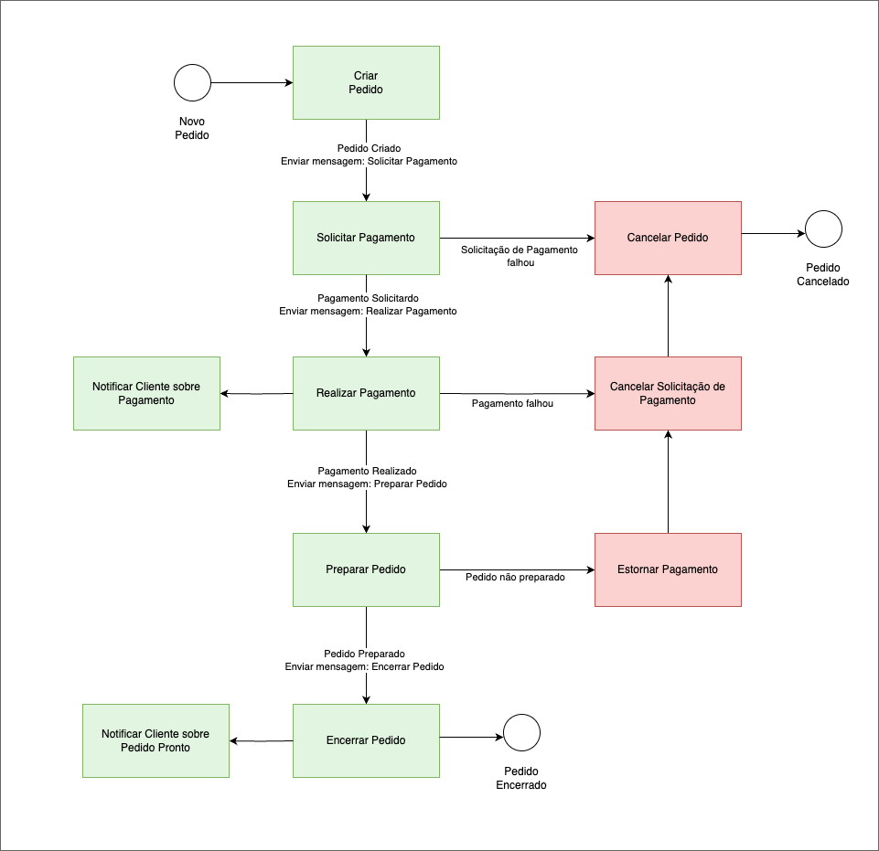
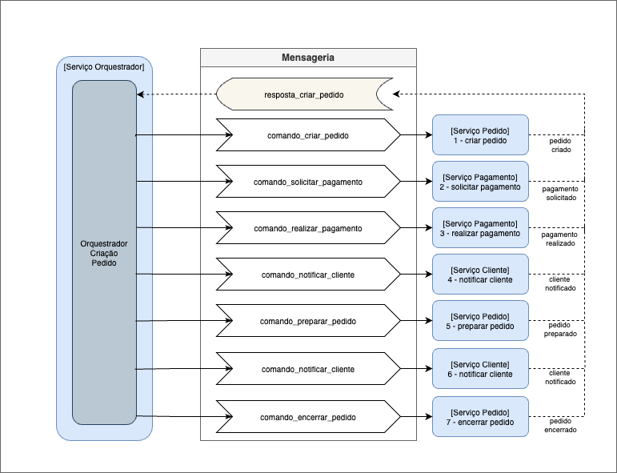
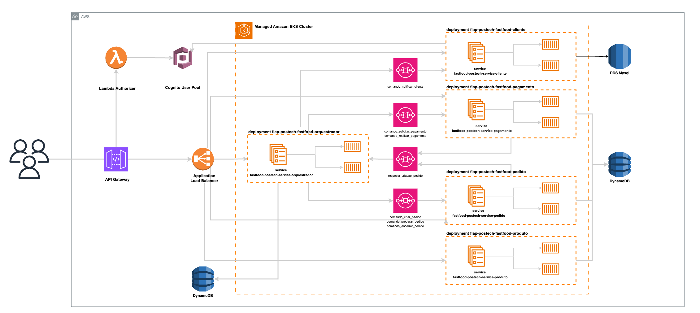
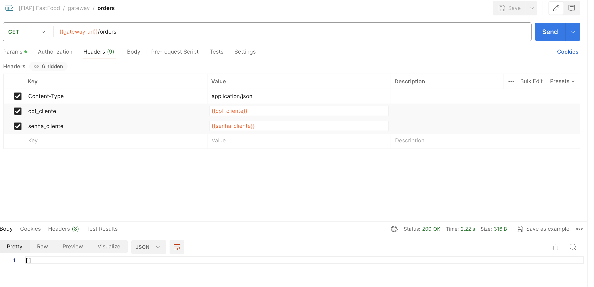

# 🚀 FIAP : Challenge Pós-Tech Software Architecture

## 🍔 Projeto Fast Food | Microsserviço de Orquestração SAGA

Projeto realizado para a Pós-Graduação de Arquitetura de Sistemas da FIAP. Criação de um sistema de autoatendimento para
uma lanchonete.

 

### 👨‍🏫 Grupo

Integrantes:

- Giovanna H. B. Albuquerque (RM352679)

 

### 📍 DDD

Estudos de Domain Driven Design (DDD) como Domain StoryTelling, EventStorming, Linguagem Ubíqua foram feitos na
ferramenta MIRO pelo grupo.
Os resultados destes estudos estão disponíveis no link abaixo:

**🔗 MIRO com DDD: https://miro.com/app/board/uXjVNMo8BCE=/?share_link_id=24975843522**

 

### ✍️ Tomada de Decisão: SAGA Pattern Orquestrado

A decisão do uso do padrão SAGA orquestrado foi pautada em dois motivos:

1) Maior facilidade de organização e visualização da sequência dos passos
2) Isolamento da lógica de orquestração, separada dos serviços responsáveis pelos domínios

Dessa maneira, foi criada a app _fastfood-orquestrador_, que conhece todos os microsserviços envolvidos na orquestração e responsabiliza-se exclusivamente por realizar o sequenciamento dos passos, controle de fluxo, persistência do andamento da transação e execução de transações compensatórias; responsabilidades essas que, se assumidas pelos serviços de forma coreografada, adicionariam várias linhas de lógica e complexidades exclusivamente relacionadas ao sequenciamento e não à gestão dos respectivos domínios.

A implementação deste microsserviço independente proporcionou maior organização, isolamento, padronização e abstração das particularidades de cada serviço.

 

### ✉️ Diagramas: SAGA Pattern Orquestrado

Desenho funcional SAGA orquestrado:

 

Desenho arquitetural SAGA orquestrado:

 

### 📐 Desenho de Solução (Arquitetura)

Solução arquitetônica realizada (Cloud AWS) completa:

 

### 📄 Relatório de Impacto à Proteção de Dados Pessoais (RIPD) - LGPD

[Link para RIPD](https://docs.google.com/document/d/10qs0Dj8RrmxudRaWXij4N-wNVyFOTaXTw0SLJiH4g6Y/edit?usp=sharing)

### 💻 Tecnologias

Tecnologias utilizadas no projeto:

* Cloud AWS
* Terraform
* Python
* Java

 

## 🎬 Como executar este projeto?

Compõem esta entrega:

* Repositório da Lambda de Autenticação

    * https://github.com/GHBAlbuquerque/fiap-postech-lambda-auth-fastfood

* Repositório da Infra (EKS, Load Balancer, Security Group)

    * https://github.com/GHBAlbuquerque/fiap-postech-infra-fastfood-eks

* Repositório da Infra (ApiGateway e Cognito User Pools)

    * https://github.com/GHBAlbuquerque/fiap-postech-infra-fastfood

* Repositório das Tabelas Dynamo

    * https://github.com/GHBAlbuquerque/fiap-postech-infra-fastfood-dynamo

* Repositório da Base de Dados RDS

    * https://github.com/GHBAlbuquerque/fiap-postech-infra-fastfood-rds

* Repositório da App de Cliente

    * https://github.com/GHBAlbuquerque/fiap-postech-fastfood-cliente

* Repositório da App de Produto

    * https://github.com/GHBAlbuquerque/fiap-postech-fastfood-produto

* Repositório da App de Pedido

    * https://github.com/GHBAlbuquerque/fiap-postech-fastfood-pedido

* Repositório da App de Pagamento

    * https://github.com/GHBAlbuquerque/fiap-postech-fastfood-pagamento

* Repositório da App Orquestradora

    * https://github.com/GHBAlbuquerque/fiap-postech-fastfood-orquestrador

* Repositório da Infra de Mensageria (SQS)

    * https://github.com/GHBAlbuquerque/fiap-postech-infra-fastfood-messaging

 

### 💿 Getting started - Rodando com CI/CD e infra descentralizada na Cloud AWS

Faça o download ou clone este projeto e abra em uma IDE (preferencialmente IntelliJ).

É preciso ter:

    - Uma conta cadastrada na Cloud AWS / AWS Academy

 

Antes de iniciar:

1. Crie manualmente bucket s3 na conta com para guardar os states do terraform (utilizei o nome
   ‘terraform-state-backend-postech’)
2. Crie manualmente repositórios ECR na conta com os nomes ‘fiap_postech_fastfood_cliente’,
   ‘fiap_postech_fastfood_produto’, ‘fiap_postech_fastfood_pedido’, ‘fiap_postech_fastfood_pagamento’ e
   ‘fiap_postech_fastfood_orquestrador’
3. Caso não esteja usando AWS Academy, é necessário criar também Policies e Roles para os serviços. Esta etapa não foi
   feita na entrega da Pós e foram usadas as Roles padrão do laboratório.

Passo-a-passo:

1. Obtenha credenciais de aws_access_key_id, aws_secret_access_key e aws_session_token da sua conta na AWS Academy ou na
   AWS.
2. Altere credenciais nos secrets para actions dos repositórios
3. Altere credenciais no arquivo .credentials na pasta .aws no seu computador caso deseje rodar a aplicação localmente
   ou usar o aws cli

 

> Subindo a Infraestrutura do projeto (LoadBalancer, Security Group e EKS Cluster)

1. Ajuste o bucket para armazenamento de estado **Repositório da Infra EKS**
    1. backend "s3" { bucket = "${SEU BUCKET}" ... } -> arquivo main.tf
2. Ajuste variáveis e segredos de Actions para CI/CD no arquivo terraform.tfvars
3. Suba infraestrutura via CICD do repositório (LoadBalancer, Security Group e EKS Cluster)
4. Ajuste o Security Group gerado automaticamente pelo cluster
    1. Libere 'Todo o Tráfego' para a VPC (ver CIDR)
    2. Libere 'Todo o Tráfego' para o Security Group criado manualmente e usado no ALB (obter id do security group)

 

> Subindo as tabelas Dynamo

1. Ajuste o bucket para armazenamento de estado **Repositório das Tabelas Dynamo**
    1. backend "s3" { bucket = "${SEU BUCKET}" ... } -> arquivo main.tf
2. Ajuste variáveis e segredos de Actions para CI/CD no arquivo terraform.tfvars
3. Suba infraestrutura via CICD do repositório

 

> Subindo o Banco de Dados RDS

1. Ajuste o bucket para armazenamento de estado **Repositório da Base de Dados RDS**
    1. backend "s3" { bucket = "${SEU BUCKET}" ... } -> arquivo main.tf
2. Ajuste variáveis e segredos de Actions para CI/CD no arquivo terraform.tfvars
3. Suba infraestrutura via CICD do repositório

 

> Subindo as filas de mensageria (SQS)

1. Ajuste o bucket para armazenamento de estado **Repositório de Mensageria**
    1. backend "s3" { bucket = "${SEU BUCKET}" ... } -> arquivo main.tf
2. Ajuste variáveis e segredos de Actions para CI/CD no arquivo terraform.tfvars
3. Suba infraestrutura via CICD do repositório

 

> Subindo a App de Cliente

1. Abra o projeto no **Repositório da App de Cliente**
2. No arquivo infra-kubernetes/manifest.yaml, no Deployment, em spec.templates.spec.containers.image:
    1. Ajuste URI do repositório remoto ECR AWS (accountId e region)
3. No arquivo infra-kubernetes/manifest.yaml, no Deployment, em spec.templates.spec.containers.env:
    1. Corrija DB_HOST mudando o endpoint do RDS
    2. Corrija COGNITO_ID mudando o valor do ClientId do Cognito
    3. Corrija ACCOUNT_ID mudando o id da conta AWS
4. Suba a aplicação via CI/CD do repositório
5. (opcional) Use o comando ``aws eks --region us-east-1  update-kubeconfig --name eks_cluster_fiap_postech`` no
   terminal para acessar seu cluster. Digite ``k9s`` para visualizar e gerenciar pods em execução.

 

> Subindo a App de Produto

1. Abra o projeto no **Repositório da App de Produto**
2. No arquivo infra-kubernetes/manifest.yaml, no Deployment, em spec.templates.spec.containers.image:
    1. Ajuste URI do repositório remoto ECR AWS (accountId e region)
3. Suba a aplicação via CI/CD do repositório
4. (opcional) Use o comando ``aws eks --region us-east-1  update-kubeconfig --name eks_cluster_fiap_postech`` no
   terminal para acessar seu cluster. Digite ``k9s`` para visualizar e gerenciar pods em execução.

 

> Subindo a App de Pedido

1. Abra o projeto no **Repositório da App de Pedido**
2. No arquivo infra-kubernetes/manifest.yaml, no Deployment, em spec.templates.spec.containers.image:
    1. Ajuste URI do repositório remoto ECR AWS (accountId e region)
3. No arquivo infra-kubernetes/manifest.yaml, no Deployment, em spec.templates.spec.containers.env:
    1. Corrija MS_PRODUTO_URL, passando o valor do DNS do Loadbalancer
    2. Corrija MS_CLIENTE_URL, passando o valor do DNS do Loadbalancer
    3. Corrija ACCOUNT_ID mudando o id da conta AWS
4. Suba a aplicação via CI/CD do repositório
5. (opcional) Use o comando ``aws eks --region us-east-1  update-kubeconfig --name eks_cluster_fiap_postech`` no
   terminal para acessar seu cluster. Digite ``k9s`` para visualizar e gerenciar pods em execução.

 

> Subindo a App de Pagamento

1. Abra o projeto no **Repositório da App de Pagamento**
2. No arquivo infra-kubernetes/manifest.yaml, no Deployment, em spec.templates.spec.containers.image:
    1. Ajuste URI do repositório remoto ECR AWS (accountId e region)
3. No arquivo infra-kubernetes/manifest.yaml, no Deployment, em spec.templates.spec.containers.env:
    1. Corrija ACCOUNT_ID mudando o id da conta AWS
4. Suba a aplicação via CI/CD do repositório
5. (opcional) Use o comando ``aws eks --region us-east-1  update-kubeconfig --name eks_cluster_fiap_postech`` no
   terminal para acessar seu cluster. Digite ``k9s`` para visualizar e gerenciar pods em execução.

 

> Subindo a App Orquestradora

1. Abra o projeto no **Repositório da App Orquestradora**
2. No arquivo infra-kubernetes/manifest.yaml, no Deployment, em spec.templates.spec.containers.image:
    1. Ajuste URI do repositório remoto ECR AWS (accountId e region)
3. No arquivo infra-kubernetes/manifest.yaml, no Deployment, em spec.templates.spec.containers.env:
    1. Corrija ACCOUNT_ID mudando o accountId da conta AWS
4. Suba a aplicação via CI/CD do repositório
5. (opcional) Use o comando ``aws eks --region us-east-1  update-kubeconfig --name eks_cluster_fiap_postech`` no terminal para acessar seu cluster. Digite ``k9s`` para visualizar e gerenciar pods em execução.

 

> Subindo a Lambda de Autenticação

1. Ajuste o bucket para armazenamento de estado **Repositório da Lambda de Autenticação**
    1. backend "s3" { bucket = "${SEU BUCKET}" ... } -> arquivo main.tf
2. Ajuste variáveis e segredos de Actions para CI/CD no arquivo terraform.tfvars
3. Suba a lambda via CICD do repositório
4. Após a criação do Cognito no passo 'Subindo a Infraestrutura do projeto (Api Gateway e Cognito User Pools)':
    1. Obtenha o ID do Cliente do Cognito na aba 'Integração da Aplicação', sessáo 'Análise e clientes de aplicação'
    2. Mude o ClientId do cognito -> arquivo lambda_auth.py (client_id)
5. Faça deploy da Lambda novamente

 

> Subindo a Infraestrutura do projeto (Api Gateway e Cognito User Pools)

1. Ajuste o bucket para armazenamento de estado **Repositório da Infra**
    1. backend "s3" { bucket = "${SEU BUCKET}" ... } -> arquivo main.tf
2. Ajuste variáveis e segredos de Actions para CI/CD no arquivo terraform.tfvars
3. Suba infraestrutura via CICD do repositório (Api Gateway e Cognito User Pools)
4. Ajuste um bug do autorizador do API Gateway que mostra erro 500 e mensagem ‘null’:
    1. Vá em ‘Autorizadores’
    2. Selecione ‘lambda_authorizer_cpf’ e editar
    3. Escolha a função lambda da lista
    4. Salve alterações
    5. Realize deploy da API no estágio ("Implantar API")
5. Teste a conexão chamando o DNS do loadbalancer na url: ``{DNS Load Balancer}/actuator/health``
6. Obtenha endereço do stage do API Gateway no console para realizar chamadas
    1. Vá em API Gateway > api_gateway_fiap_postech > estágios > pegar o valor 'Invoke Url'

 

> Utilizando a API

1. Copie o conteúdo do arquivo misc/API/openapi.json
2. Vá para o site 'https://editor.swagger.io/' e cole o json copiado na esquerda
3. Veja os endpoints disponíveis para a API
4. Para realizar chamadas aos endpoints http do gateway, utilize a 'Invoke URL' e os seguintes headers:
    1. cpf_cliente -> valor cadastrado previamente: 93678719023
    2. senha_cliente -> valor cadastrado previamente: FIAPauth123_

OU

1. Abra o arquivo misc/API/index.html no seu navegador
2. Veja os endpoints disponíveis para a API
3. Para realizar chamadas aos endpoints http do gateway, utilize a 'Invoke URL' e os seguintes headers:
    1. cpf_cliente -> valor cadastrado previamente: 93678719023
    2. senha_cliente -> valor cadastrado previamente: FIAPauth123_

 

> (opcional) Criar usuário e utilizar

1. Crie um usuário utilizando o endpoint POST '/clients'
2. O username será o cpf informado
3. Pegue o código de verificação enviado para o e-mail
4. Confirme a criação do usuário para permitir o uso em endpoints: envie uma requisição para o endpoint POST '
   /customers/confirmation' (utilizando cpf e o código)
5. Utilize o cpf e senha cadastrados para fazer solicitações como orientado acima

Ex. de chamada:

 

> (opcional) Desativar usuário

1. Utilize o id de cliente para desativar o usuário, de acordo com as definições da LGPD
2. Utilize os headers de 'cpf_cliente' e 'senha_cliente' nos Headers para autenticação
3. Envie uma requisição para o endpoint DELETE '/customers' 
4. O usuário será desativado, com a _flag_ de isActive setada como false e alguns dados pessoais permanentemente apagados da base
5. O usuário será removido do Identity Provider e impossibilitado de acessar quaisquer outras APIs

Ex. de chamada:

 

### Algumas regras:

1. É necessário um cliente corretamente cadastrado no Cognito para realizar chamadas
2. CPF precisa ser único
3. A requisição para novo Pedido precisa ter um cliente cadastrado para criar um pedido (validado através do customerId)
4. A requisição para novo Pedido precisa ter um produto cadastrado para criar um pedido (validado através do productId)
5. O valor unitário do produto na requisição precisa estar correto (validado com o produto cadastrado)

 

## Autores

*Giovanna Albuquerque* [@GHBAlbuquerque](https://github.com/GHBAlbuquerque)

*FIAP*  [@FIAP Software Architecture](https://postech.fiap.com.br/curso/software-architecture/)

Feito em 2024